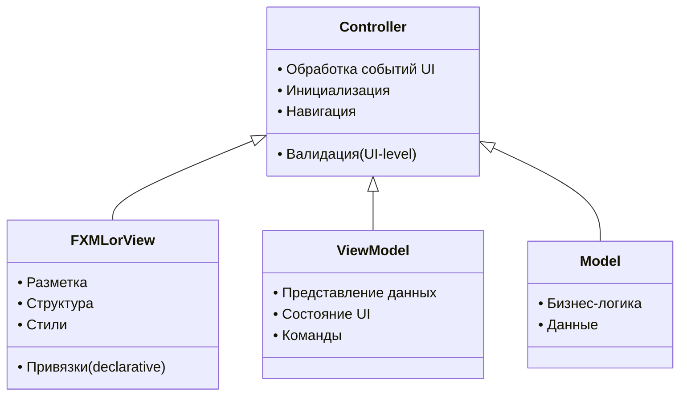

# О проекте
__Умный планировщик задач__ — это полноценное desktop-приложение на Java с использованием JavaFX 25.0.1, созданное для эффективного управления задачами с праздничной новогодней атмосферой. Приложение сочетает в себе функциональность классического To-Do листа с визуально приятным интерфейсом и анимационными эффектами.
## Основные возможности:
1. __Управление задачами__ — создание, редактирование, удаление задач
2. __Интеллектуальная сортировка__ — по дате и приоритету
3. __Быстрый поиск__ — мгновенный поиск по всем задачам
4. __Визуальное выделение__ — цветовое кодирование приоритетов
5. __Атмосферная анимация__ — падающие снежинки в реальном времени
6. __Иммерсивный опыт__ — звуковые эффекты и тематический дизайн

## Перспектива
Как же дальше развивать этот проект:
Можно добавить в компьютер как фоновое приложение и сделать всплывающие окна.

## Архитектура проекта
Проект реализован с использованием архитектуры MVVM (Model-View-ViewModel), что обеспечивает четкое разделение ответственности:
### Структура проекта:
```
src/
├── app/                   # Запуск приложения
│   └── MainApp.java       # Главный класс приложения
├── model/                 # Модель данных
│   ├── Task.java          # Класс задачи
│   ├── Priority.java      # Перечисление приоритетов
│   ├── Category.java      # Перечисление категорий
│   └── TaskManager.java   # Менеджер задач
├── view/                  # Представление
│   ├── MainController.java        # Контроллер главного окна
│   ├── NewTaskController.java     # Контроллер диалога
│   ├── SnowflakeAnimation.java    # Анимация снежинок
│   ├── MainView.fxml              # FXML главного окна
│   └── NewTaskDialog.fxml         # FXML диалога
├── viewmodel/             # ViewModel
│   └── TaskViewModel.java # ViewModel для задач
└── util/                  # Утилиты
    ├── JsonUtil.java      # Работа с JSON
    └── AudioManager.java  # Управление аудио
```
__Разберём по папкам наш проект.__
#### Начнём с папки util
Папка util (от utility — утилита, полезность) содержит вспомогательные классы, которые не относятся напрямую ни к Model, ни к View, ни к ViewModel, но необходимы для работы приложения. Это "инфраструктурный слой", который:
1. Инкапсулирует повторяющуюся функциональность
2. Изолирует сторонние зависимости
3. Предоставляет сервисы для всех слоев
4. Следует принципу Single Responsibility

##### Класс JsonUtil: Мост между приложением и файловой системой

| Преимущество | Пример в коде | Выгода для проекта |
| ------------ | ------------- | ------------------ |
|Единство реализации | Один парсер JSON для всего приложения | Нет рассинхронизации форматов |
|Централизованная обработка ошибок | Все IOException в одном месте |	Единая стратегия восстановления |
|Простота использования |	JsonUtil.loadTasks() вместо 30 строк кода | Ускорение разработки |
|Легкость тестирования |	Можно тестировать отдельно от остального кода	| Высокое качество кода |
|Возможность замены | Заменить JSON на XML, изменив один класс | Гибкость архитектуры |

__Его задачи:__
1. Загрузить существующие задачи           
2. Добавить новую задачу                
3. Сохранить обновленный список            
4. Вернуть результат (успех/ошибка)

##### Класс AudioManager: Абстракция над мультимедиа
| Критерий | AudioManager | Причина размещения в util |
| -------- | ------------ | ------------------------- |
|Зависимости |	Зависит от JavaFX Media | Изолирует зависимости от остального кода |
|Переиспользование |	Используется в разных View | Централизованное управление |
|Сложность |	Управление ресурсами, обработка ошибок | Скрывает сложность от бизнес-логики |
|Тестирование |	Может быть заглушен (mocked) | Упрощает тестирование контроллеров |
|Конфигурация	| Настройка громкости, включение/выключение	| Единое место для конфигурации |

__Выводы: Почему util необходим__
1. Архитектурная чистота: Отделяет инфраструктурный код от бизнес-логики
2. Сопровождаемость: Изменения в работе с файлами/аудио в одном месте
3. Тестируемость: Утилиты можно тестировать изолированно
4. Переиспользование: Один раз написал — используй везде
5. Масштабируемость: Легко добавить новые утилиты по мере роста проекта

#### Папка Model
Папка model: Сердце приложения — бизнес-логика и данные

В нашей реализации Model состоит из 4 классов:
>Task.java — основная сущность, модель данных задачи
>Priority.java — перечисление приоритетов (enum)
>Category.java — перечисление категорий (enum)
>TaskManager.java — менеджер задач (бизнес-логика)

##### Класс TaskManager: Оркестратор бизнес-логики
Мы используем Singleton.

| Критерий | Статический класс | Singleton (наш выбор) |
| -------- | ----------------- | --------------------- |
| Состояние |	Только статические поля |	Может иметь состояние |
| Наследование |	Не поддерживает |	Поддерживает (если нужно) |
| Интерфейсы |	Не может реализовать | Может реализовать |
| Ленивая | инициализация	Нет (загружается при старте) |	Да (при первом вызове) |
| Тестирование |	Сложно мокать	| Легко мокать (можно заменить) |

#### Папка ViewModel
Папка viewmodel: Преобразователь данных и состояние представления, он является адаптером в нашем проекте.

__Проблема:__ Model содержит "сырые" данные для бизнес-логики, а View нужны отформатированные данные для отображения. Прямое соединение приводит к:
1. Нарушению Single Responsibility: Model начинает заниматься форматированием
2. Сильной связанности: Изменения в Model ломают View
3. Сложности тестирования: Нельзя тестировать View без Model
4. Дублированию кода: Форматирование размазано по разным местам

__Ключевые преимущества:__
1. Разделение ответственности: Model занимается логикой, ViewModel — презентацией
2. Тестируемость: ViewModel можно тестировать без UI
3. Гибкость: Одна Model может иметь несколько ViewModel для разных представлений
4. Связность: Data Binding уменьшает boilerplate код
5. Поддержка MVVM: Соответствие современным архитектурным стандартам

__Почему именно отдельная папка?__
1. Ясная структура: Поиск ViewModel в одном месте
2. Четкие границы: Нельзя случайно смешать с Model
3. Масштабируемость: Легко добавлять новые ViewModel
4. Поддержка команды: Новые разработчики понимают архитектуру

__Без ViewModel наш проект был бы:__
1. Слабо тестируемым: Бизнес-логика смешана с UI логикой
2. Сложным для изменений: Изменение формата даты потребует правки во многих местах
3. Нарушающим SRP: Классы делают слишком много
4. Менее производительным: Постоянное преобразование данных в UI потоке
5. Трудно поддерживаемым: Неясно, где искать логику отображения

#### Папка View
Папка view: Визуальная реализация интерфейса. По сути это слой представления, который отвечает за всё, что видит и с чем взаимодействует пользователь. В контексте паттерна MVVM, View — это "глупый" компонент, который:
1. Только отображает данные из ViewModel
2. Только передает пользовательские действия в ViewModel
3. Не содержит бизнес-логики
4. Не управляет состоянием приложения

##### FXML файлы: Декларативное описание интерфейса
FXML — это XML-базированный язык разметки, специально разработанный для JavaFX. Он позволяет описывать пользовательский интерфейс декларативно, отделяя структуру UI от логики.



__Контроллер__ — это посредник между View и ViewModel. Его ответственность:
1. Инициализация UI компонентов
2. Обработка пользовательских событий
3. Навигация между окнами
4. Валидация ввода (уровень UI)
5. Управление жизненным циклом View

## Модель данных
### Структура задачи (Task):
```json
{
  "id": "уникальный-идентификатор",
  "title": "Название задачи",
  "description": "Подробное описание",
  "startTime": "2025-12-01T09:00:00",
  "endTime": "2025-12-01T18:00:00",
  "priority": "URGENT | IMPORTANT | NORMAL",
  "category": "WORK | HOME | STUDY | OTHER",
  "completed": false,
  "overdue": false,
  "createdAt": "2025-11-30T10:00:00"
}
```
### Приоритеты задач:
| Приоритет | Цвет | Описание |
| --------- | ---- | -------- |
| URGENT (Срочно)| 🔴 Красный | Критические задачи, требующие немедленного внимания |
| IMPORTANT (Важно) | 🟡 Желтый | Важные задачи (используется по умолчанию) |
| NORMAL (Желательно) | 🟢 Зеленый | Обычные задачи без срочности |
### Категории:
1. WORK (Работа) — профессиональные задачи
2. HOME (Дом) — домашние дела
3. STUDY (Учёба) — образовательные задачи
4. OTHER (Другое) — прочие задачи

## Ключевые технологии:
1. Java 25.0.1 LTS — последняя стабильная версия Java
2. JavaFX 25.0.1 — современный UI фреймворк
3. MVVM архитектура — чистый и поддерживаемый код
4. JSON для хранения — человеко-читаемый формат данных
5. CSS стилизация — кастомизируемый интерфейс

# Генерация Doxygen файла
### Запуск и просмотр
>./generate_docs.sh
>open docs/html/classes.html

### Просмотр конфигурации
>doxygen -s Doxyfile

### Генерация с другим конфигом
>doxygen -s myconfig

Обновление конфига до новой версии
>doxygen -u Doxyfile

Просмотр всех опций
>doxygen -h

Генерация только для определенных файлов
>doxygen -w html header.html footer.html stylesheet.css

Проверка незадокументированных элементов
>grep -r "Undocumented" docs/html/*.html

Подсчет задокументированных методов
>grep -c "@brief" src/**/*.java

Сначала проверьте конфигурацию
>doxygen -s Doxyfile | head -20

### Файл для документации
Откройте в браузере:
open docs/html/index.html
Или: file:///Users/sigm/Work/Institut/5semestr/OOP_Java/Project/docs/html/index.html

# Лицензия
Проект создан для образовательных целей и может использоваться как основа для собственных приложений. Все исходные коды доступны для изучения и модификации.

## Скрипты
>./run.sh - запуск проекта
>./run_test.sh - запуск юнит-тестов
>./generate_docs - сборка doxygen документации
>./build_jar.sh - сборка проекта в jar файл
>./create_max_app.sh - создание приложения для MacOS

